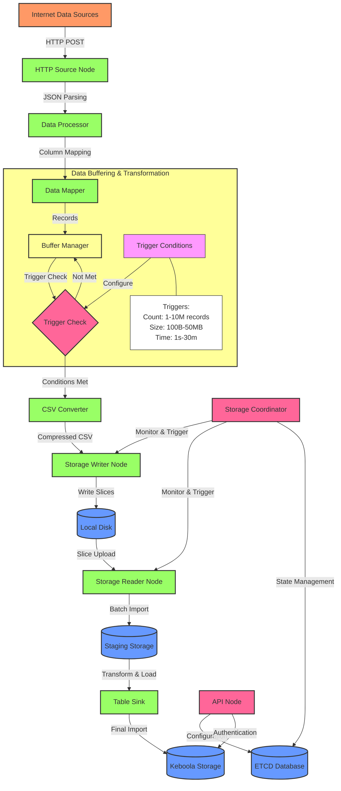

# Keboola Streaming Service Documentation

## Overview

The Keboola Streaming Service is a sophisticated data ingestion system designed for continuously importing data into the Keboola platform. It provides a robust, scalable architecture for handling real-time data streams and efficiently processing them into Keboola Storage tables.

## Core Components

The service architecture consists of two main node types:

### 1. API Nodes
- Handle configuration endpoints
- Collect data through the Import endpoint
- Manage service configuration in etcd database
- Process user authentication and request validation
- Minimal resource usage (CPU/Memory)

### 2. Worker Nodes

#### HTTP Source Node
- Receives records via HTTP endpoints
- Converts incoming data to CSV format
- Compresses the data for efficient storage
- Resource usage scales with request rate

#### Storage Writer Node
- Receives compressed CSV data
- Stores data on local disk
- Requires sufficient memory and disk speed
- Manages data persistence and integrity

#### Storage Reader Node
- Uploads data slices from local disk to staging storage
- Handles data transfer optimization
- Works in conjunction with writer node
- Manages upload queues and retries

#### Storage Coordinator Node
- Orchestrates the entire data flow
- Monitors system statistics
- Triggers key operations:
  - Slice uploads from local disk to staging
  - File imports from staging to target tables
  - State management in etcd
- Minimal resource requirements

## Data Flow Architecture



## Data Processing Pipeline

1. **Data Reception & Parsing**
   - External systems send data via HTTP POST requests
   - JSON payloads are received and validated
   - Data is parsed according to configured mappings:
     - Static column mapping
     - Path-based extraction from JSON
     - Template-based transformations (using Jsonnet)

2. **Data Buffering & Triggers**
   - Incoming data is buffered with configurable triggers:
     - Record count: 1 to 10,000,000 records
     - Data size: 100B to 50MB per slice
     - Time interval: 1 second to 30 minutes
   - Buffer configuration options:
     - Uncompressed buffer size: up to 16MB
     - Compressed chunk size: 64KB to 1MB
     - Sync check interval: minimum 5ms
   - Compression settings:
     - GZIP compression (parallel implementation)
     - Configurable block size (default 256KB)
     - Adjustable compression level

3. **Slice Management**
   - Data is organized into slices for efficient processing
   - Slice states:
     - Writing: actively receiving data
     - Closing: preparing for upload
     - Uploading: transferring to staging
     - Uploaded: ready for import
   - Slice rotation triggers:
     - Count threshold reached
     - Size threshold reached
     - Time interval elapsed
   - Disk space allocation:
     - Static allocation: configurable size (e.g., 100MB)
     - Dynamic allocation: percentage-based growth (110% of previous)

4. **Storage Operations**
   - Local storage:
     - Compressed CSV format
     - Organized in volumes and slices
     - Configurable disk allocation
   - Staging process:
     - Minimum upload interval: 1 second
     - Upload triggers:
       - Record count threshold
       - Size threshold (up to 50MB)
       - Time interval (up to 30 minutes)
   - Import process:
     - Configurable batch size
     - Import triggers:
       - Record count (up to 50,000)
       - File size
       - Time interval (1 minute default)
       - Slice count threshold
       - Expiration time (5-45 minutes)

5. **Performance Optimization**
   - Network transfer:
     - Configurable chunk sizes
     - Keep-alive intervals
     - Response buffering
   - Load balancing:
     - Round-robin or random distribution
     - Minimum slices per source node
   - Operation timeouts:
     - Slice rotation: 5 minutes
     - Slice close: 1 minute
     - Slice upload: 15 minutes
     - File import: 15 minutes

## Configuration and Monitoring

### Service Configuration
- Stored in etcd database
- Managed through API endpoints
- Includes:
  - Source definitions
  - Sink configurations
  - Processing rules
  - Performance parameters

### Performance Monitoring
- CPU and memory usage tracking
- Disk I/O monitoring
- Request rate monitoring
- Import job status tracking

### Resource Requirements

| Component | CPU Usage | Memory Usage | Disk Requirements |
|-----------|-----------|--------------|-------------------|
| API Node | Minimal | Minimal | N/A |
| HTTP Source | Scales with requests | Moderate | N/A |
| Storage Writer/Reader | Moderate | High | High-speed storage |
| Coordinator | Minimal | Minimal | N/A |

## Security and Data Protection

- Authentication via Storage API tokens
- CORS policy implementation
- Encrypted data transmission
- Secure storage handling
- Access control management

## Best Practices

1. **Scaling Considerations**
   - Monitor request rates
   - Adjust node resources as needed
   - Balance storage capacity

2. **Performance Optimization**
   - Configure appropriate batch sizes
   - Set optimal trigger thresholds
   - Monitor system metrics

3. **Error Handling**
   - Implement retry mechanisms
   - Monitor error rates
   - Set up alerts for critical issues

## Integration Guidelines

The service can be integrated with any system capable of making HTTP requests. Example integration:

```json
POST https://stream.keboola.com/v1/data
Headers:
  X-StorageApi-Token: your-token
  Content-Type: application/json

Body:
{
  "data": {
    "field1": "value1",
    "field2": "value2"
  }
}
```

For detailed API documentation, visit: https://developers.keboola.com/integrate/push-data/
